# Workforce Dependency Graph

This graph visualizes the relationship between the Orchestrator, its defined Workflows, and the specialized agents.

```mermaid
graph TD
    %% Orchestrator
    MO[MasterOrchestrator]

    %% Workflows -> Agents
    MO -->|trend_research| TA[TrendAgent]
    MO -->|trend_research| RA[ResearchAgent]
    
    MO -->|ebook_market_research| ERA[EbookResearchAgent]
    
    MO -->|seo_optimization| SRA[SEOResearchAgent]
    
    MO -->|content_creation| CA[CopywritingAgent]
    
    MO -->|article_production| WA[WriterAgent]
    MO -->|article_production| PA[PageonatorAgent]
    
    MO -->|content_publishing| WA
    MO -->|content_publishing| PA
    MO -->|content_publishing| PUBA[PublisherAgent]
    
    MO -->|ebook_production| CDA[CoverDesignerAgent]
    MO -->|ebook_production| WA
    MO -->|ebook_production| PA
    
    MO -->|product_sale| SA[SalesAgent]
    
    MO -->|product_fulfillment| SA
    MO -->|product_fulfillment| FA[FulfillmentAgent]
    
    MO -->|business_review| BMA[BusinessManagerAgent]
    
    MO -->|financial_audit| FAA[FinancialAdviserAgent]
    
    MO -->|strategic_planning| BPA[BusinessPlannerAgent]
    
    MO -->|business_automation| BAA[BusinessAutomationAgent]
    
    MO -->|workflow_planning| WPA[WorkflowPlannerAgent]
    
    MO -->|digital_product_creation| PA
    MO -->|digital_product_creation| DPCA[DigitalProductsCreatorAgent]
    
    MO -->|product_packaging| PA
    MO -->|product_packaging| DPCA
    MO -->|product_packaging| PPA[ProductsPackagerAgent]
    
    MO -->|product_ideation| DPCONA[DigitalProductConceptAgent]

    %% Shared Databases
    TA & RA & ERA & SRA & CA & WA & PA & PUBA & CDA & SA & FA & BMA & FAA & BPA & BAA & WPA & DPCA & PPA & DPCONA -.-> DB[(DatabaseManager)]
```

### Dependency Rules Summary
- Orchestrator dispatches tasks to specific agents based on the `workflow_id`.
- All agents depend on the `BaseAgent` structure and `DatabaseManager` for persistence.
- Workflows define the sequence of agent execution and context chaining.
